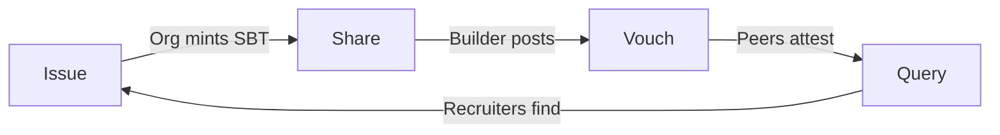

<p align="center">
  
</p>

**Reputation on Base. Verifiable & Forever.**

> *Built for the Base Indonesia Hackathon 2026.* 🇮🇩

---

## � The Problem: Current Certs are L
Let's be real. Traditional certifications are kinda broken:
- **PDFs?** Easily photoshopped.
- **LinkedIn Flexes?** Often cap (fake).
- **Contributions?** Lost in the void.

Builders do the work, but have no **permanent, owned proof** of their impact.

## ✨ The Solution: Based
**Based** gives you onchain receipts for your work. No cap, just facts.

We issue **Soulbound Tokens (SBTs)** aka **Proofs of Contribution** on Base Sepolia.
- **You own it**: It lives in your wallet, not a centralized server.
- **Verifiable**: Anyone can check the smart contract.
- **Forever**: Immutable proof that you were there and you did that.

**It's not just a certificate. It's your onchain legacy.**

---

## 🎯 Who is BASED for?
- **Hackathon Organizers**: Issue verifiable proof of attendance and winning in seconds, not weeks.
- **Builders**: Build a permanent, onchain resume ensuring your hard work is never lost.
- **Recruiters**: Hire based on verified contribution history, not just self-reported resumes.

## 🔄 Reputation Lifecycle

1. **Issue**: Organizations mint SBTs for contributors.
2. **Share**: Builders share their measurable impact on social networks.
3. **Vouch**: Peers attest to the quality of work (Roadmap).
4. **Query**: Recruiters find talent based on verified skills.

> [!IMPORTANT]
> **What BASED does NOT measure:**
> BASED verifies *that* you did something (attendance, submission, verified role), but it does not inevitably measure the *subjective quality* of code (yet). We provide the trust layer; humans provide the context.

---

## 🚀 Features (Alpha)
- **⚡ Mint Speed**: Instant issuance by authorized orgs.
- **🆔 Basename Native**: We speak `.base.eth` fluently. No more boring `0x` addresses everywhere.
- **🔒 Soulbound**: Non-transferable. You earned it, you keep it. You can't buy reputation here.
- **📱 Social Ready**: One-click flex to Farcaster & X.

## ⛓️ The Tech (Under the Hood)
We built this using the freshest stack on the market:

| Component | Tech | Why? |
| :--- | :--- | :--- |
| **Network** | **Base Sepolia** | Fast, Cheap, & Based. |
| **Framework** | **Next.js 15** | Peak performance & DX. |
| **Identity** | **OnchainKit + Wagmi** | Seamless Basename resolution. |
| **Styling** | **Tailwind CSS** | Clean UI, no clutter. |

**Smart Contract:** [`0x639c...904`](https://sepolia.basescan.org/address/0x639c4DeB80473729437072449910633347520904)

---

## � Network Details
If you need to add Base Sepolia manually to your wallet:

| Setting | Value |
| :--- | :--- |
| **Network Name** | Base Sepolia |
| **RPC Endpoint** | `https://sepolia.base.org` |
| **Chain ID** | `84532` |
| **Currency Symbol** | `ETH` |
| **Block Explorer** | `https://sepolia.basescan.org` |

---

## �🏃‍♂️ Run it Locally

Clone the repo and join the movement.

```bash
# 1. Clone it
git clone https://github.com/ReyhanZidany/based.git

# 2. Enter the arena
cd based/frontend

# 3. Installing dependencies
npm install

# 4. Let's go
npm run dev
```

Open `http://localhost:3000` and start shipping.

---

## 🏆 Hackathon Tracks
**Based** is positioned for the **Base Track** (Consumer App / Identity).
We solve meaningful UX challenges in social coordination by making achievements verifiable and interoperable.

---

<p align="center">
  <sub>Built with 💙 by Builders, for Builders.</sub><br/>
  <sub>Based on specific truths.</sub>
</p>