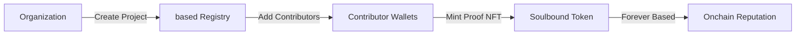

# 🔵 based

**stay based on Base**

<p align="center">
  
  
  
</p>

---

## 🎯 The Problem

Real contributions have no real proof. 

- 📄 Hackathon certificates? Photoshoppable. 
- 💼 LinkedIn achievements? Self-claimed.
- 🤝 Volunteer work? Just photos.
- 👥 Team contributions? No permanent record.

**That's not very based.**

---

## 💡 The Solution

**based** turns contributions into onchain credentials — not profiles, not claims, but cryptographic facts.

Every contribution: 
- ✅ Recorded onchain (Base L2)
- ✅ Non-transferable (true soulbound)
- ✅ Owned by your wallet forever
- ✅ Publicly verifiable
- ✅ Immutable proof

**No cap, all facts.**

---

## 🏗️ How It Works



1. **Organizations** create projects (hackathons, events, open source)
2. **Contributors** get added to projects
3. **Proof NFTs** are minted to contributor wallets
4. **Public profiles** show all contributions (verifiable forever)

---

## 🔥 Why "based"?

- **based** = authentic, real, unapologetically yourself (Gen Z approved)
- Built on **Base** L2 (meta wordplay unlocked)
- Only based contributors, based proofs
- Too based to fake

---

## ✨ Features (MVP - Midpoint)

### Completed ✅
- [x] Soulbound NFT smart contract
- [x] Non-transferable token logic
- [x] Batch minting for organizations
- [x] Deployed on Base Sepolia testnet

### In Progress 🚧
- [ ] Frontend application (Next.js + OnchainKit)
- [ ] Public profile pages
- [ ] Organization dashboard
- [ ] IPFS metadata storage

### Planned 📋
- [ ] QR code verification
- [ ] LinkedIn integration
- [ ] Analytics dashboard
- [ ] Base Mainnet deployment
- [ ] API for third-party integration

---

## 🛠️ Tech Stack

**Smart Contracts:**
- Solidity ^0.8.20
- OpenZeppelin (ERC-721, Access Control)
- Hardhat development framework

**Blockchain:**
- Base Sepolia (testnet)
- Base Mainnet (final deployment)

**Frontend:**
- Next.js 14
- OnchainKit (Coinbase)
- TailwindCSS
- Wagmi/Viem

**Infrastructure:**
- IPFS (metadata storage)
- The Graph (indexing)
- Vercel (hosting)

---

## 📋 Deployed Contracts

### Base Sepolia (Testnet)

- **BasedNFT Contract Address:**  
  `0x639c4DeB80473729437072449910633347520904`

- **Explorer (BaseScan):**  
  https://sepolia.basescan.org/address/0x639c4DeB80473729437072449910633347520904

- **Network:** Base Sepolia  
- **Chain ID:** 84532

### Contract Highlights
- Soulbound (non-transferable) ERC-721
- Organization-authorized minting
- Batch minting for scalability
- Onchain, permanent proof of contribution

### Contract Features
```solidity
// Mint single proof
function mintBased(address contributor, string projectName, string role)

// Batch mint for organizations
function batchMintBased(address[] contributors, string projectName)

// Get all proofs for contributor
function getContributorProofs(address contributor)

// Non-transferable (soulbound)
function _update() // Overridden to prevent transfers
```

---

## 🎯 Use Cases

### 🏆 Hackathons & Competitions
- Organizers mint proof to all participants
- Winners get special role badges
- Permanent record of participation

### 🎓 Education & Courses
- Universities mint proof of graduation
- Course completion certificates
- Immutable academic records

### 🤝 DAOs & Communities
- Core contributor recognition
- Governance participation proof
- Community role verification

### 💼 Corporate & Startups
- Employee achievement records
- Project contribution tracking
- Performance verification

### 🌍 Volunteering & Social Impact
- Volunteer hour verification
- Non-profit contribution proof
- Social impact portfolio

---

## 🚀 Roadmap

### Phase 1: Foundation (Jan 2026) ✅
- ✅ Core smart contracts
- ✅ Testnet deployment
- 🚧 Basic frontend

### Phase 2: Launch (Feb 2026)
- Web application (create projects, mint proofs)
- Public profile pages
- Base Mainnet deployment
- Base Indonesia Hackathon demo

### Phase 3: Growth (Mar-Apr 2026)
- Mobile-responsive design
- QR code verification
- Organization analytics dashboard
- 10+ pilot organizations

### Phase 4: Scale (May-Aug 2026)
- API for third-party integration
- LinkedIn credential verification
- Multi-chain expansion
- 1,000+ active organizations

### Phase 5: Protocol (Sep 2026+)
- Open standard for contribution proofs
- SDK for developers
- Reputation scoring algorithm
- Global adoption

---

## 💼 Business Model

### Free Tier
- Individual contributors (unlimited)
- Basic proof minting
- Public profile

### Organization Tier ($49/month)
- Unlimited proof minting
- Custom proof templates
- Analytics dashboard
- Priority support

### Enterprise Tier (Custom)
- White-label solution
- API access
- Custom integrations
- Dedicated support
- SLA guarantees

---

## 👥 Team

**ReyhanZidany** - Founder & Full-Stack Developer
- Smart Contract Development
- Frontend Engineering
- Product Design

---

## 🏆 Base Indonesia Hackathon 2025

**Track:** Base Track  
**Category:** Identity & Reputation Infrastructure  
**Timeline:** Dec 10, 2025 - Jan 31, 2026  
**Demo Day:** Feb 7, 2026 (Jakarta)

### Why based fits Base: 
- ✅ Consumer-facing onchain application
- ✅ Solves real identity/reputation problem
- ✅ Leverages Base's low gas fees
- ✅ Perfect for social onchain use case
- ✅ Can onboard retail users to Base
- ✅ Meta branding (based on Base)

---

## 📚 Documentation

### For Contributors
See [CONTRIBUTOR_GUIDE.md](./docs/CONTRIBUTOR_GUIDE.md) (coming soon)

### For Organizations
See [ORG_GUIDE.md](./docs/ORG_GUIDE.md) (coming soon)

### For Developers
See [DEVELOPER_DOCS.md](./docs/DEVELOPER_DOCS.md) (coming soon)

---

## 🔗 Links

- **Website:** [Coming Soon]
- **Demo Video:** [Coming Soon]
- **Twitter:** [@basedproof](https://twitter.com/basedproof) (example)
- **Discord:** [Coming Soon]

---

## 📜 License

MIT License - see [LICENSE](./LICENSE)

---

## 🙏 Acknowledgments

Built with support from:
- **Base** - L2 infrastructure
- **BlockDevId** - Hackathon organizers
- **OpenZeppelin** - Smart contract libraries
- **Coinbase** - OnchainKit

---

<p align="center">
  <strong>stay based.  stay real. stay onchain.</strong>
</p>

<p align="center">
  <sub>Built on Base | Powered by Truth | Made in Indonesia 🇮🇩</sub>
</p>